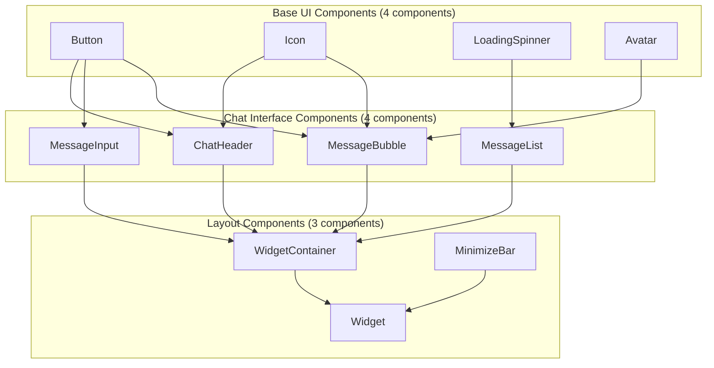

# System Architecture & Technical Specifications: Embeddable AI Chatbot Widget (MFE)

**Author:** Lester Dela Vega
**Date:** 2025-06-21
**Status:** Phase 1.2 Complete - All UI Components Built & Tested

-----

## 1\. Architectural Drivers & Decisions (The "Why")

This section covers the technical drivers and high-level architectural decisions that align with the product's goals.

### 1.1. Overview & Business Goals

The primary technical goal is to engineer a **portable, framework-agnostic, client-side Micro-Frontend (MFE)**. This application will serve as the user interface for the headless AI Chat API. It must be self-contained, performant, and designed for dead-simple integration into any host website, thereby providing a scalable solution for adding a chat UI without requiring frontend development from the consumer.

### 1.2. Key Architectural Drivers

#### Constraints

  * **Technical:** The application must be built using a modern JavaScript toolchain (Vite, React, TypeScript). It must compile into a single JavaScript bundle to facilitate easy embedding. The application must be completely stateless, relying on the external API for all business logic.
  * **Budgetary:** The compiled artifact must be deployable on free-tier static hosting platforms or CDNs.
  * **Integration:** Must be able to run on any HTML page, regardless of the host website's framework (or lack thereof).

#### Non-Functional Requirements (NFRs)

  * **Performance:** The initial gzipped bundle size should be under 200kB for the development version (target: <100kB for production) to ensure a fast load time. The UI must remain responsive and avoid jank, especially while rendering streaming text responses.
  * **Portability:** The widget must not depend on any global variables or libraries (like jQuery) provided by the host page. It must be entirely self-sufficient.
  * **Security:** The widget must not store any long-term secrets. The API key will be received at runtime, held in memory for the duration of the session, and never persisted. All communication with the backend API must be over HTTPS.
  * **Style Encapsulation:** The widget's CSS must not conflict with the host page's styles.

### 1.3. Core Architectural Decisions

  * **Architectural Pattern:** **Micro-Frontend (MFE).** The application is designed as a "guest" that is dynamically loaded and mounted into a "host" webpage. This pattern ensures complete decoupling.
  * **Technology Stack:** **Vite + React + TypeScript**. This stack was chosen for Vite's optimized build tooling that easily produces small bundles, React's powerful ecosystem for building interactive UIs, and TypeScript's robust type safety.
  * **State Management:** For the MVP, state will be managed locally within React components using built-in hooks (`useState`, `useReducer`). The core chat logic will be encapsulated in a custom hook leveraging the Vercel `ai/react` library for efficient handling of streaming state.
  * **Integration Method:** **Dynamic Script Loading with `data-*` attribute configuration.** The host page provides a `<div>` mount point and a `<script>` tag. The script loads the MFE bundle, which then reads its configuration (API URL, key) from the `data-*` attributes on the mount point.

-----

## 2\. High-Level System Design (The "What")

This section provides a visual overview of the MFE's internal structure and its place in the broader system.

### 2.1. Architecture Diagram

This diagram shows the internal components of the MFE and its interaction with the host page and the external API.

```mermaid
graph TD
    subgraph Host Website
        A[HTML Page]
        B(div#ai-chatbot-root)
        C(script tag)
        A -- Contains --> B
        A -- Contains --> C
    end

    subgraph "Chatbot MFE (Loaded by Script)"
        D[Entrypoint/Config Loader]
        E[State Manager <br> (useChat Hook)]
        F[UI Components <br> (ChatWindow, MessageList, etc.)]
        G[API Client <br> (fetch)]

        D -- Reads config from --> B
        D -- Initializes --> E
        E -- Provides state to --> F
        F -- Triggers actions in --> E
        E -- Makes calls via --> G
    end
    
    subgraph External Services
        H[Headless AI Chat API]
    end

    C -- Loads --> D
    G -- HTTPS Request --> H

```

*Diagram shows the Host Website containing the mount `div` and `script` tag. The script loads the MFE, which reads its configuration from the `div`, initializes its state manager and UI, and communicates with the external Headless API.*

### 2.2. Component Architecture (Current Implementation)

The MFE follows a three-tier component architecture for maximum reusability and maintainability:



*Component hierarchy showing how base components compose into feature components, which then compose into the complete widget system.*

### 2.3. System Workflow Example: End-User Sends a Message

This sequence diagram details the internal and external interactions when a user sends a message.


*Workflow demonstrates the flow from user input to state update, the API call, and the real-time rendering of the streaming response.*

-----

## 3\. Technology & Environment (The "With")

This section details the specific technologies used and the development environment.

### 3.1. Development Environment Setup

  * **Node.js:** `v20.x` or later.
  * **Package Management:** `pnpm` is the recommended package manager.
  * **Git:** For version control.

### 3.2. Technology Stack

| Category | Technology | Rationale & Usage Notes |
| :--- | :--- | :--- |
| **Build Tool** | `Vite` | Chosen for its fast development server and optimized build outputs for libraries/MFEs. |
| **UI Framework** | `React` | Industry-standard for building complex, stateful user interfaces. |
| **Language** | `TypeScript` | For end-to-end type safety from API client to UI components. |
| **Styling** | `Tailwind CSS` | Utility-first for rapid development. Will be configured with a prefix to prevent style collisions. |
| **State Management** | Vercel `ai/react` SDK | Provides the `useChat` hook for robust, out-of-the-box management of streaming chat state. |
| **API Communication** | `fetch` API | The `useChat` hook uses the browser-native `fetch` API internally. |
| **Hosting** | Static CDN | The final build artifact is a single JS file, hostable on any CDN or static hosting platform. |

### 3.3. Current Technical Status

**Bundle Size (Development):**
- **Total Bundle**: 573.93 kB (168.51 kB gzipped)
- **CSS Bundle**: 26.14 kB (6.14 kB gzipped)
- **Target for Production**: <100KB gzipped

**Component System:**
- **Total Components**: 11 fully functional components
- **Base Components**: 4 (Button, Icon, LoadingSpinner, Avatar)
- **Feature Components**: 4 (MessageBubble, MessageList, MessageInput, ChatHeader)
- **Layout Components**: 3 (WidgetContainer, MinimizeBar, Widget)

**Features Implemented:**
- Widget state management (normal/fullscreen/minimized)
- Responsive design for mobile and desktop
- Smooth CSS animations for all state transitions
- Comprehensive TypeScript interfaces
- Mock data integration and testing

-----

## 4\. Detailed Technical Implementation (The "How")

This section provides granular details on implementation patterns and conventions.

### 4.1. Key Implementation Decisions

  * **Embedding & Configuration:** The application's main entry point (`main.tsx`) will be responsible for finding the mount `div` (e.g., `#ai-chatbot-root`) and extracting the `data-api-url` and `data-api-key` from its dataset attributes. These values will be passed as configuration to the main React `App` component.
  * **Streaming Logic:** The Vercel AI SDK's `useChat` hook will be the core of the chat functionality. It will be configured at initialization with the `apiUrl` and `headers` (containing the `X-API-Key`) read from the embedding configuration. This decision mitigates the risk of implementing complex streaming logic manually.
  * **Widget State Management:** A comprehensive state system manages three modes: normal, fullscreen, and minimized. The `Widget` component orchestrates the `WidgetContainer` and `MinimizeBar` components with smooth transitions between states.
  * **Style Encapsulation:** To prevent CSS conflicts with host websites, the `tailwind.config.js` file will be configured with a `prefix`. For example, setting `prefix: 'aicb-'` will transform utilities like `bg-blue-500` into `aicb-bg-blue-500`, guaranteeing style isolation.

### 4.2. Component Design Patterns

**Base Components:**
- Reusable UI primitives with consistent APIs
- Support for variants, sizes, and states
- Full TypeScript interfaces for props
- Accessibility features built-in

**Feature Components:**
- Chat-specific functionality built on base components
- Compose multiple base components for complex features
- Handle chat-specific state and interactions
- Responsive design for optimal mobile/desktop experience

**Layout Components:**
- Manage widget-level state and positioning
- Handle complex state transitions with smooth animations
- Coordinate between different widget modes
- Provide consistent container behavior

### 4.3. Design Patterns & Coding Conventions

  * **Folder Structure:** A standard feature-based React project structure:
    ```
    /src
        /components  # Base UI components (Button, Icon, etc.)
        /features    # Feature-specific components (future: chat features)
        /hooks       # Custom hooks (future: useChat, useWidgetState)
        /lib         # Utility functions and API client
        main.tsx     # Application entry point
    ```
  * **Component Design:** Components follow the single-responsibility principle. Each component has a clear purpose and well-defined interface. Components are designed to be composable and reusable.
  * **State Management:** Currently using component-level state with React hooks. Future phases will introduce custom hooks for chat functionality and widget state management.

### 4.4. Technical Constraints

  * The final build output must be a single JavaScript file. Vite's library mode is configured to achieve this.
  * The application must not rely on any global variables or libraries from the host page. React and all dependencies are bundled into the application.
  * The application must gracefully handle and display network errors or non-200 status codes from the API, informing the user that the service is unavailable.

-----

## 5\. Current Implementation Status

### 5.1. Completed Components

**Base UI Components (4/4 Complete):**
1. **Button** - Multiple variants (primary, secondary), sizes (sm, md, lg), loading states
2. **Icon** - 9 icons with configurable size and stroke-based SVG implementation
3. **LoadingSpinner** - Multiple sizes and color variants with CSS animations
4. **Avatar** - User/bot types with fallback handling and responsive sizing

**Chat Interface Components (4/4 Complete):**
1. **MessageBubble** - User/assistant styling with status indicators and timestamps
2. **MessageList** - Scrollable container with auto-scroll, empty state, and loading indicators
3. **MessageInput** - Auto-resizing textarea with character limit and keyboard shortcuts
4. **ChatHeader** - Title/subtitle display with minimize/fullscreen/close controls

**Layout Components (3/3 Complete):**
1. **WidgetContainer** - Fullscreen mode with backdrop and escape key handling
2. **MinimizeBar** - Bottom bar with "AI Chatbot" text and positioning options
3. **Widget** - Complete state management system coordinating all widget modes

### 5.2. Technical Quality Achieved

- **TypeScript**: Strict compilation with comprehensive interfaces
- **Responsive Design**: Mobile-first approach with desktop optimization
- **Smooth Animations**: CSS transitions for all state changes
- **Accessibility**: ARIA labels and keyboard navigation support
- **Performance**: Efficient re-rendering with React optimization patterns

### 5.3. Next Phase Requirements

**Phase 1.3 - Static UI Integration & Polish:**
- Integrate all components into cohesive chat experience
- Implement comprehensive state management
- Add keyboard navigation and accessibility improvements
- Fine-tune animations and micro-interactions
- Add session persistence for user preferences

-----

## 6\. Future Considerations

  * **API Integration (Phase 2):** The `useChat` hook will be implemented to connect with the streaming API. The existing component system is designed to easily integrate with real-time data.
  * **Theming:** To support the "theme customization" feature, the `useWidgetConfig` hook would be extended to read additional `data-theme-primary-color` attributes. These values would then be applied to the root element as CSS variables, allowing for easy theming.
  * **`localStorage` History:** To support conversation persistence, the `useChat` hook can be wrapped in another custom hook that synchronizes its `messages` state with `localStorage` on change. An initial configuration `data-enable-history="true"` would be used to enable this feature.
  * **Bundle Optimization:** Current development bundle is 573KB (168KB gzipped). Production optimizations will target <100KB gzipped through tree-shaking, code splitting, and dependency optimization.
  * **Testing Strategy:** The project will include unit tests for hooks and components using `Vitest`. End-to-end testing of the embedding mechanism will be done using a simple `index.html` file within a `/test-harness` directory.